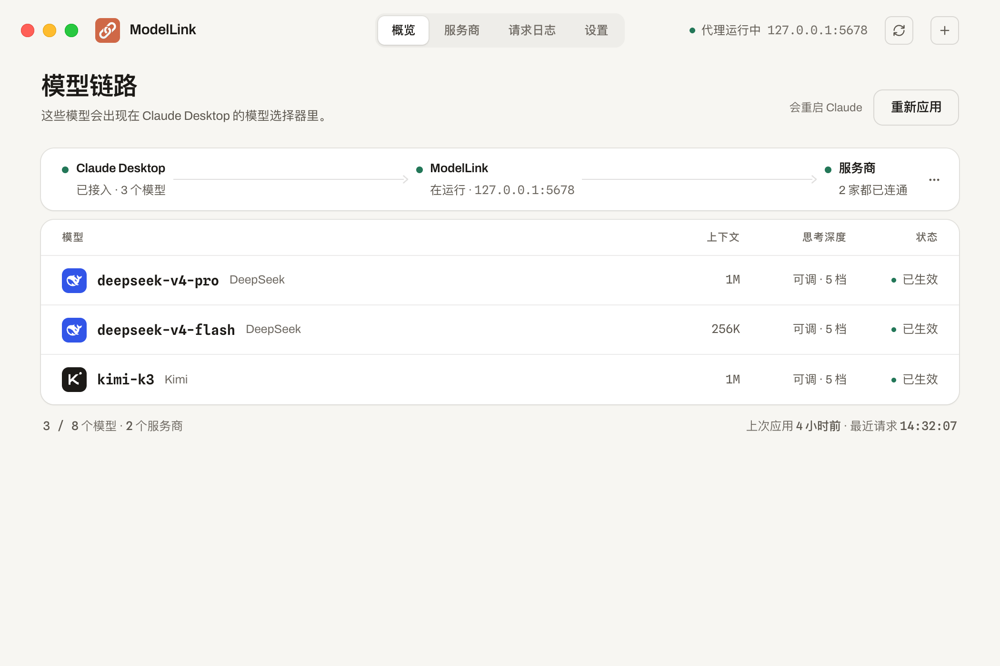
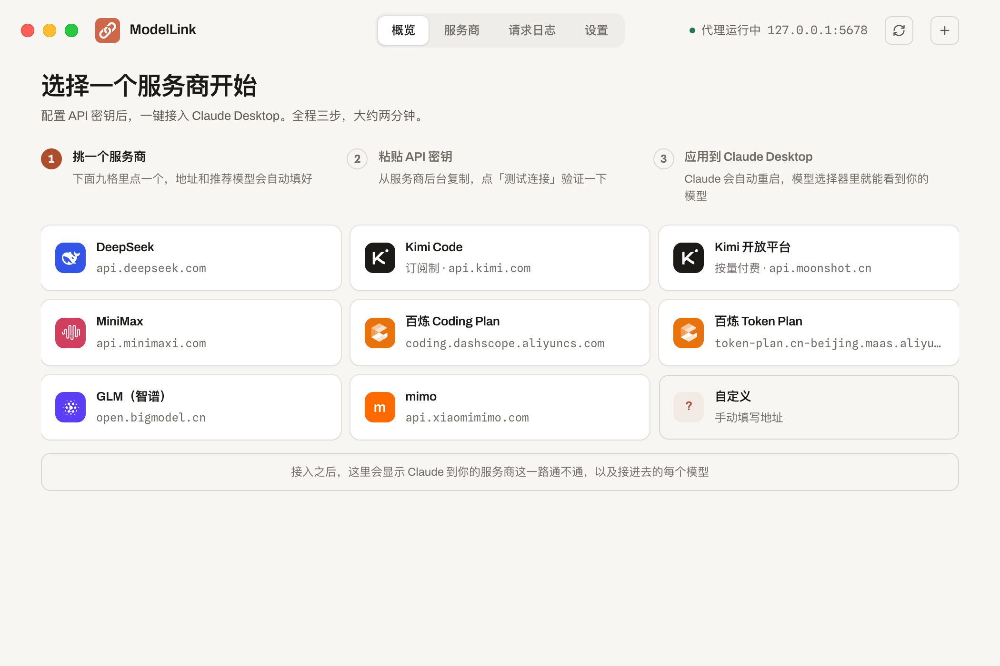
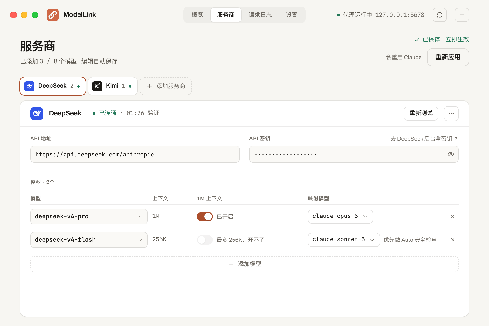
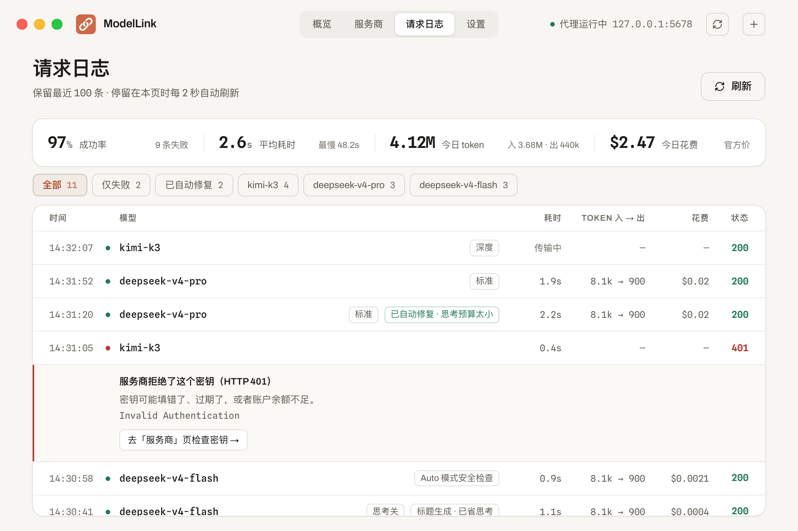
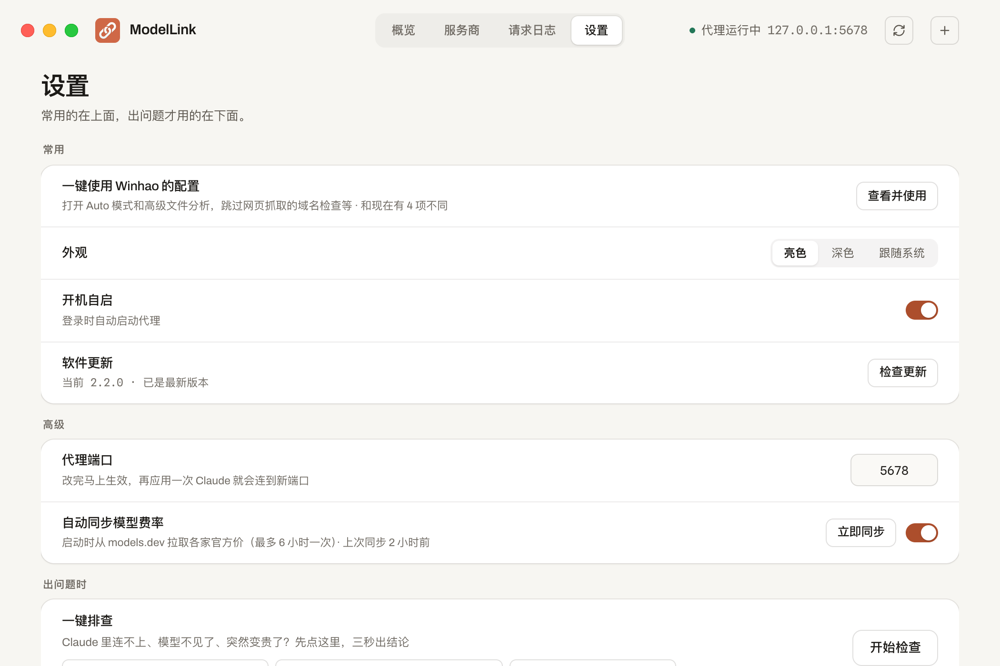

<div align="center">

# ModelLink

**让 Claude Desktop 桌面端接入任意第三方 API 模型的本地代理工具**

Kimi · MiniMax · 百炼 · 智谱 GLM · DeepSeek · mimo — 一键切换，无缝使用

[](https://creativecommons.org/licenses/by-nc-nd/4.0/)
[](#下载)
[](#免责声明与版权)

<br/>

<picture>
  <source media="(prefers-color-scheme: dark)" srcset="docs/images/overview-dark.png">
  
</picture>

<br/>

</div>

> **本软件完全免费，仅供个人学习和非商业用途。严禁任何形式的商业化行为，包括但不限于出售、收费分发、嵌入付费产品等。**
>
> 作者：**Winhao学AI**（抖音搜索同名，抖音号：**54927876676**）
>
> 如果你是花钱买到的这个软件，你被骗了，请举报卖家。

## 2.2 有什么新东西

- **界面重做**：顶部导航、更大的窗口、新的深色模式。概览页一眼看清 Claude → ModelLink → 服务商这一路通不通，每个模型是「已生效」还是「未应用」
- **Claude 里直接调思考深度**：模型选择器里出现思考深度（最多 5 档），选哪档就按哪档发给服务商
- **模型在 Claude 里用哪个代号，自己选**：代号决定能不能调思考深度、有没有 Auto 模式；增删模型不会打乱别的模型
- **Auto 模式看得见**：安全检查优先交给 claude-sonnet-5 上的模型，新加的模型默认先放这里；日志里标出每一次安全检查
- **请求日志更有用**：耗时、token、花费一目了然；出错的请求用大白话说原因，并带你去改
- **一键使用 Winhao 的配置 / 一键排查**：Auto 模式、高级文件分析这些 Claude 工作区开关一次调好；Claude 里连不上、模型不见了，先点排查
- **费用不再是假账单**：按各家服务商官方价计算（从 [models.dev](https://models.dev) 自动同步），有模型查不到价格就不显示，不再按 Anthropic 官方价估算
- **不再悄悄换模型**：Claude 请求了没配置的模型时直接报错；开着 1M 上下文但模型装不下时，界面标出真实上限
- **更稳**：服务商不认思考参数、思考预算太小等报错自动修复重试；长回答期间自动保活，减少断流

<details>
<summary>2.0 的改动</summary>

2.0 是一次彻底重写（Tauri v2 + React），老用户**无感升级**——端口、配置文件、Claude 接入方式完全不变：

- **模型链路板**：Claude 槽位 → 真实模型的映射直接画出来
- **Claude 里直接显示厂商模型名**：模型选择器显示 `Kimi-k2.6` 这样的真名
- **自动保存 + 应用状态提醒**：改没改、生效没生效，页头一眼看清
- **应用内自动更新**：从 2.0 起新版本自动提醒、一键安装（macOS）
- **代理端口可配置**：默认 5678，被占用时可在设置页更换
- **整页请求日志**：保留最近 100 条，自动刷新
- 修复 Windows 开机自启无效的问题

</details>

<div align="center">

&nbsp;&nbsp;


<sub>左：首次启动三步引导（内置 8 家服务商预设） &nbsp;|&nbsp; 右：服务商页，每个模型可选在 Claude 里用的代号</sub>

<br/><br/>


&nbsp;&nbsp;


<sub>左：请求日志（耗时 / token / 花费） &nbsp;|&nbsp; 右：设置页（一键使用 Winhao 的配置、一键排查）</sub>
</div>

## 功能

- 将第三方模型（DeepSeek、Kimi、智谱 GLM、MiniMax、百炼、mimo 等）接入 Claude Desktop
- 支持同时配置多个 API 服务商（所有服务商的模型加起来最多 8 个），内置 8 家服务商预设（带品牌图标），也可自定义
- Claude 原生思考深度选择器与 Auto 模式；每个模型在 Claude 里用的代号可选
- 真实费率表（models.dev 自动同步）；1M 上下文按模型真实能力判定
- 上游报错自动修复重试；长回答保活心跳；连接测试；一键排查
- 请求日志（耗时 / token / 花费）、开机自启、深色/亮色/跟随系统主题、代理端口可配置
- 菜单栏/系统托盘常驻，关闭窗口后代理继续运行

> **联网说明**：为了让费用估算保持准确，ModelLink 启动时会向 [models.dev](https://models.dev)
> （社区维护的开源模型数据库）请求一次费率和模型清单，最多 6 小时一次。可在设置页关闭。
> 除此之外和检查软件更新，ModelLink 不会主动联网。

## 下载

从 [Releases](../../releases) 页面下载：

| 平台 | 文件 |
|------|------|
| macOS (Apple Silicon) | `ModelLink_x.y.z_aarch64.dmg` |
| Windows | `ModelLink_x.y.z_x64-setup.exe` |

## 安装

### macOS

1. 下载 `.dmg`，双击打开，把 `ModelLink.app` 拖入「应用程序」
2. 2.0 起为正式签名 + 公证版本，直接双击打开即可

### Windows

1. 下载 `-setup.exe`，双击安装
2. 首次运行如果触发 Windows Defender 警告，选择「仍然运行」

## 首次使用

1. 打开 **ModelLink**，首页会列出内置服务商预设，点一个（或「自定义」）
2. 填写 API 密钥，点「测试连接」验证
3. 点「**应用到 Claude Desktop**」——Claude 会自动重启并接入
4. 在 Claude Desktop 的模型选择器中选择你配置的模型即可

> ModelLink 启动时会自动写入 Claude Desktop 的第三方推理配置；编辑自动保存，无需手动点保存。

### Windows 首次额外一步（仅一次）

ModelLink 会自动写入大部分配置，但首次使用需在 Claude Desktop 中手动完成一步：

1. 打开 Claude Desktop，点左上角 **☰** → **Developer** → **Configure third-party inference**
2. 切换到 **Form view**（左下角）
3. **Gateway URL** 填 `http://127.0.0.1:5678`，**API Key** 填 `proxy`
4. 点 **Apply locally**

> 之后所有模型/服务商的增删改都只在 ModelLink 里完成。

## 用 Auto 模式

- 只有在 Claude 里用 `claude-opus-5`、`claude-sonnet-5`、`claude-opus-4-8`、`claude-opus-4-7` 这几个代号的模型能选 Auto 模式，和背后是哪家的模型无关。代号在「服务商」页的「映射模型」一列换
- Auto 模式默认是关的：在设置页点「**一键使用 Winhao 的配置**」会顺手打开，也可以在 Claude Desktop 的第三方推理设置里自己开
- 跑命令这类操作之前，Claude 会先做一次安全检查。检查优先交给 `claude-sonnet-5` 上的模型；它没映射或出错，就改用你正在对话的模型。**建议把主力模型放在 `claude-sonnet-5`**
- 安全检查同样消耗 token，在请求日志里标为「Auto 模式安全检查」，花了多少一眼能看到

## 从 2.0 升级

直接覆盖安装或用应用内自动更新（macOS）。2.2 换了模型在 Claude 里用的代号，所以：

- 升级后概览页会提示「新版要重新应用一次」，点一次「**应用到 Claude Desktop**」即可，配置文件无需迁移
- 升级前开着的对话如果提示「模型槽位 … 未映射到任何服务商」，在 Claude 的模型选择器里给它重新选一个模型

## 从 1.x 升级

直接用新安装包覆盖安装即可：

- 配置文件（`~/.claude-model-proxy/config.json`）原样沿用，服务商列表无损保留
- 代理端口（5678）与 Claude 接入方式不变，Claude Desktop 无需重新配置
- 打开 ModelLink 后点一次「**应用到 Claude Desktop**」，换上新的模型代号
- 老版本的「开机自启」会自动迁移到新机制
- 从 2.0 起支持应用内自动更新，以后不用再手动下载

## 构建

需要 Node.js ≥ 20 与 Rust 工具链：

```bash
cd gui-tauri
npm install
npm run tauri dev     # 开发
npm run tauri build   # 打包
```

发版流程（签名/公证/latest.json）见 [`gui-tauri/SIGNING.md`](gui-tauri/SIGNING.md)。
1.x 的单文件实现保留在 [`claude-model-proxy/`](claude-model-proxy/)（只读存档）。

## 免责声明与版权

- 本软件按「现状」提供，不对任何使用后果负责；API 费用由所选服务商收取，与本软件无关
- 版权所有 © Winhao学AI，采用 [CC BY-NC-ND 4.0](https://creativecommons.org/licenses/by-nc-nd/4.0/) 许可
- **完全免费，不可商业化**；二次分发请保留出处
